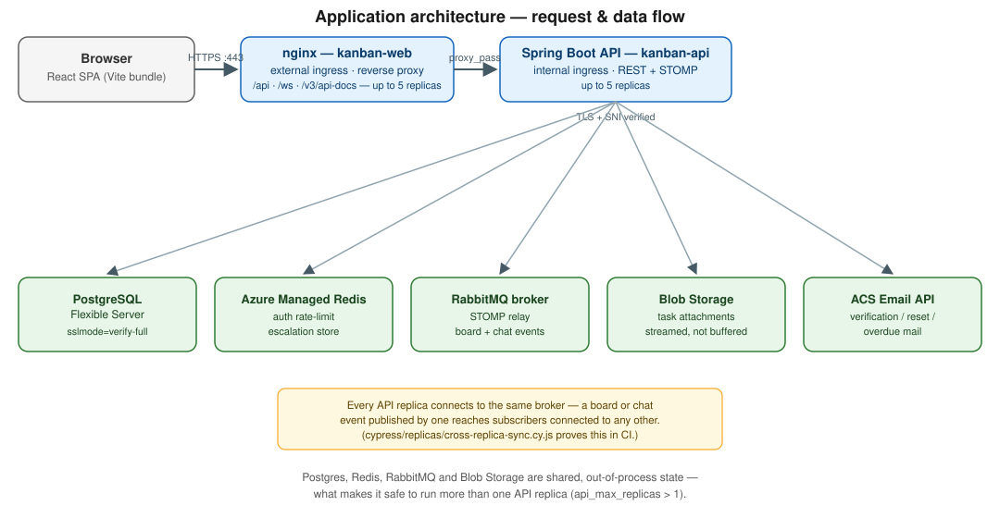
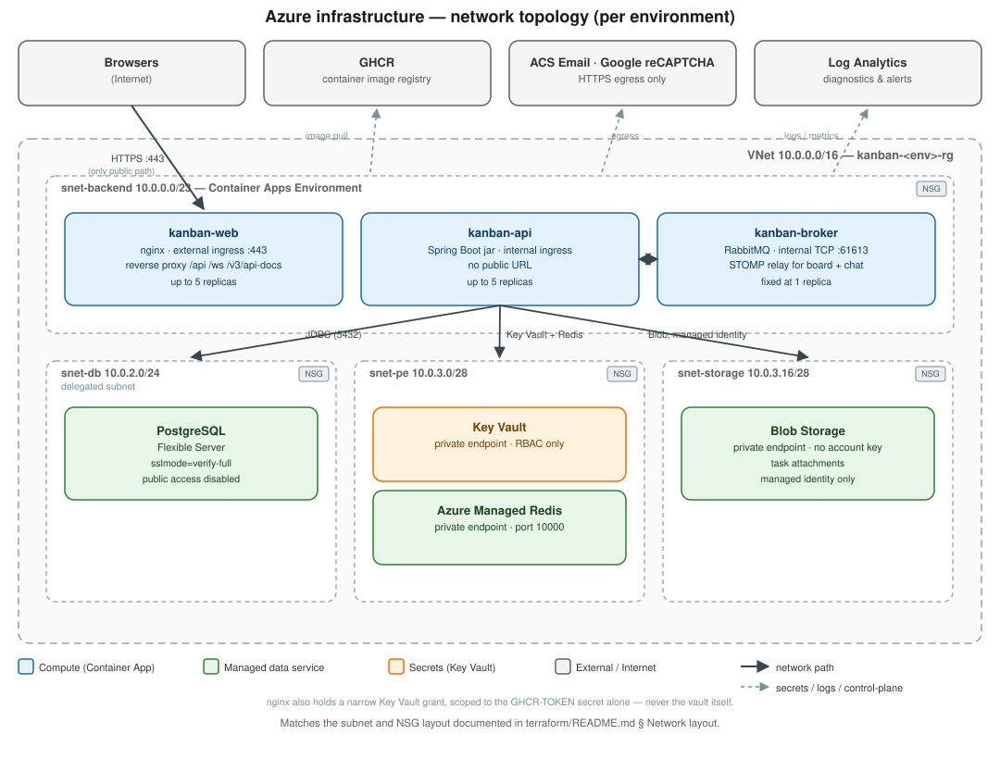

<p align="center">
  
</p>

<h1 align="center">KanbanProject</h1>

<p align="center">
  
  
  
  
  
</p>

<p align="center">
  A flexible Kanban board application designed to help teams visualize and manage their workflow efficiently. This project provides an interactive drag-and-drop interface for task management with support for multiple views, columns, rows, and WIP limits.
</p>

<p align="center">
  <a href="https://docs.kanbanproject.pl/" target="_blank">📘 User Guide</a>
</p>

## 📋 Table of Contents

- [📋 Overview](#-overview)
- [✨ Features](#-features)
- [🛠️ Technologies](#️-technologies)
- [📦 Prerequisites](#-prerequisites)
- [💻 Installation](#-installation)
- [🚀 Running the Application](#running-the-application)
  - [Using Docker](#using-docker)
  - [Running Locally](#running-locally)
- [📝 Usage](#-usage)
- [🏗️ Project Structure](#️-project-structure)
- [☁️ Deployment & Infrastructure](#️-deployment--infrastructure)
- [🧪 Testing](#-testing)
- [👥 Contributing](#-contributing)
- [👨‍💻 Authors](#-authors)
- [📄 License](#-license)

## 📋 Overview

KanbanProject is a web-based task management system implementing Kanban methodology. It enables effective task visualization, workflow management, and productivity tracking through an intuitive drag-and-drop interface.

## ✨ Features

- 🔄 Interactive Kanban board with drag-and-drop functionality
- 📊 Column and row-based work organization
- ✏️ Task creation, editing, and deletion
- 📋 Subtask support for breaking down complex tasks
- ⚠️ Work In Progress (WIP) limits for columns, rows, and users
- 👤 User assignments to tasks
- 🏷️ Labels for task categorization
- 📎 File attachments on tasks, streamed to and from Azure Blob Storage
- 🌙 Dark mode support

## 🛠️ Technologies

- **Backend**: Java 21 language level with Spring Boot 4.1, built and run on JDK 25
- **Frontend**: React 19 with Vite 8
- **Database**: PostgreSQL
- **Containerization**: Docker
- **Testing**: JUnit, Mockito, JaCoCo for test coverage

## 📦 Prerequisites

- [Java 21](https://www.oracle.com/java/technologies/downloads/)
- [Node.js 20.19](https://nodejs.org/) or higher - Vite 8 refuses to start below it; CI and the
  Docker build both use 26
- [npm](https://www.npmjs.com/) or [Yarn](https://yarnpkg.com/)
- [PostgreSQL](https://www.postgresql.org/) (if running locally)
- [Docker](https://www.docker.com/) and [Docker Compose](https://docs.docker.com/compose/) (if using containers)

## 💻 Installation

1. Clone the repository:

```bash
git clone https://github.com/dominiksmolinski3/KanbanProject.git
cd KanbanProject
```

## 🚀 Running the Application

### 🐳 Using Docker

The easiest way to run the application is using Docker, which handles all dependencies:

1. Make sure Docker and Docker Compose are installed on your system
2. From the project root directory, create your environment file and fill in the values:

```bash
cp .env.example .env
```

3. Start the stack:

```bash
docker-compose up -d
```

4. The application will be available at [http://localhost:8080](http://localhost:8080)

   That port is the `web` service -- nginx serving the built bundle and reverse-proxying `/api`,
   `/ws` and `/v3/api-docs` to the `app` container, which is the same shape the deployment has. The
   API container publishes `127.0.0.1:8081` as well, for poking it directly: `/actuator` is
   deliberately not proxied, so asking `:8080` for it answers 404 by design.

   `docker compose --profile replicas up -d` adds a second API replica on `127.0.0.1:8082` --
   the same image and the same environment as the first, sharing the Postgres, the Redis and the
   RabbitMQ the deployment shares. That is the shape `api_max_replicas = 5` actually runs, and it
   is what `cypress/replicas/cross-replica-sync.cy.js` needs.

   The stack also brings up [Azurite](https://learn.microsoft.com/azure/storage/common/storage-use-azurite),
   the Blob Storage emulator, so task attachments work locally without an Azure subscription. It
   publishes no port -- only the app talks to it, the same way a deployed storage account answers
   nobody but the application's own VNet. Set `AZURE_STORAGE_CONNECTION_STRING` in `.env` to point
   somewhere else; with storage unconfigured entirely the app still starts and refuses uploads with
   a clear 503.

   A plain `redis` service backs the auth rate limiter's escalation (`security.rate-limit.redis-*`),
   so the login/signup limits mean what their numbers say even if you run more than one `app`
   replica locally. Nothing to configure -- the app finds it by service name.

5. To stop the application:

```bash
docker-compose down
```

### 💻 Running Locally

#### Backend

1. Navigate to the backend directory (from root folder):

```bash
cd backend
```

2. Configure the database and secrets:

   `application.properties` resolves every secret from the environment and imports an optional
   `.env` file from the working directory, so **no credentials belong in `application.properties`** --
   leave that file as it is. Copy the template instead and fill it in:

```bash
cp .env.example .env
```

   | Variable | Description |
   | --- | --- |
   | `SPRING_DATASOURCE_URL` | JDBC URL, e.g. `jdbc:postgresql://localhost:5432/kanban` |
   | `SPRING_DATASOURCE_USERNAME` | PostgreSQL user |
   | `SPRING_DATASOURCE_PASSWORD` | PostgreSQL password |
   | `JWT_SECRET_KEY` | JWT signing key -- generate one, e.g. `openssl rand -base64 32` |
   | `ACS_EMAIL_CONNECTION_STRING` | Azure Communication Services connection string (portal -> your resource -> Keys). Empty turns mail off |
   | `ACS_EMAIL_SENDER_ADDRESS` | MailFrom address on the linked domain, e.g. `DoNotReply@<guid>.azurecomm.net` |

   `.env` is gitignored. Docker Compose uses its own `.env` in the repository root -- see
   [Using Docker](#-using-docker).

3. Build and run the backend:

```bash
./mvnw clean package
./mvnw spring-boot:run
```

The backend will start on [http://localhost:8080](http://localhost:8080)

#### Frontend

1. Navigate to the frontend directory (from root folder):

```bash
cd frontend
```

2. Install dependencies (the legacy flag is required -- the dependency tree has peer conflicts):

```bash
npm ci --legacy-peer-deps
```

3. Start the frontend application:

```bash
npm run dev
```

The frontend will be available at [http://localhost:5173](http://localhost:5173)

## 📝 Usage

1. Create columns representing your workflow stages (e.g., "To Do", "In Progress", "Done")
2. Add rows for categorizing work types or projects
3. Create tasks by clicking the "Add Task" button
4. Drag and drop tasks between columns to update their status
5. Click on a task to view details, add subtasks, or assign team members
6. Configure WIP limits for columns to prevent overloading stages

## 🏗️ Project Structure

The project is organized as follows:

- `/backend` - Java Spring Boot application
   - /src/main/java - Java source code
   - /src/main/resources - config files
   - /src/test - test classes
- `/frontend` - React.js web application
   - /src/components - React components
   - /src/services - API services
   - /src/styles - CSS and styling
- `/terraform` - Azure infrastructure as code
- `/.github/workflows` - CI/CD pipelines
- `/docs` - architecture diagrams and supporting write-ups

## ☁️ Deployment & Infrastructure

### How a request flows through the system

<p align="center">
  
</p>

Browser traffic lands on **nginx** (the only public address), which serves the built bundle from
disk and reverse-proxies `/api`, `/ws` and `/v3/api-docs` to the **Spring Boot API** over an
internal, TLS-verified connection. The API is the only thing that talks to the five pieces of
shared, out-of-process state -- Postgres, Azure Managed Redis, the RabbitMQ STOMP broker, Blob
Storage and the ACS Email API -- which is what lets both `web` and `api` run more than one replica
without disagreeing with each other or with themselves.

### Azure infrastructure

<p align="center">
  
</p>

Every push to `main` builds two images -- [backend/Dockerfile](backend/Dockerfile), the Spring Boot
jar, and [frontend/Dockerfile](frontend/Dockerfile), nginx with the Vite bundle -- scans each with
Trivy and publishes both to the GitHub Container Registry:

```bash
docker pull ghcr.io/dominiksmolinski3/kanbanproject-app:latest
docker pull ghcr.io/dominiksmolinski3/kanbanproject-web:latest
```

Images are tagged with the commit SHA as well, and `:latest` is only promoted after the vulnerability
scan passes. **Both carry the same tag**, deliberately: the browser and the API it calls used to be
one artifact and could not disagree, and one tag feeding both is what replaces that guarantee.

The Azure environment behind it is three Container Apps in one Managed Environment --
**`kanban-web`** (nginx, the only external ingress), **`kanban-api`** (the Spring Boot jar, internal
only, up to 5 replicas) and **`kanban-broker`** (RabbitMQ's STOMP plugin, fixed at one replica, the
shared relay every API replica connects to) -- running under user-assigned managed identities, a
PostgreSQL Flexible Server VNet-injected into a delegated subnet with public access disabled, an
Azure Managed Redis instance backing the auth rate limiter's escalation, a Key Vault and a Storage
account (task attachments) both closed to the internet and reached over private endpoints with no
account key, plus the VNet/NSGs and Log Analytics. All of it is defined as Terraform in
[terraform/](terraform/). See [terraform/README.md](terraform/README.md) for the Azure RBAC
prerequisites, the network layout and the per-environment state layout.

Workflows live in [.github/workflows/](.github/workflows/): `kanban-ci.yml` (backend tests against a
Postgres and Redis service container, frontend build/lint/Jest, an `e2e` job that runs Cypress
against a two-replica `docker-compose` stack, and an `image-scan` job that Trivy-scans both images
on every PR), `kanban-cd.yml` (build, scan, push, promote), `deployed-contract.yml` (a daily sweep
that asks the deployed origin whether it still matches what the trunk claims), `codeql.yml` (CodeQL
analysis of the Java backend), `migration-order.yml` (guards Flyway migration numbering across
branches), `terraform-ci.yml` (fmt/validate/Checkov), `hadolint.yml` (both Dockerfiles),
`sweep-alarm.yml` (the shared alarm every scheduled workflow reports through), and the dependency and
attack-surface scans (`dependency-review.yml`, `dependabot-auto-merge.yml`, `dependency-scan.yml`,
`external-scan.yml`, `dast.yml`).

## 🧪 Testing
The project uses JUnit, Mockito, Jest, Eslint and Cypress for linting checks, unit, integration and e2e testing. Test coverage is monitored with JaCoCo.

All tests are automatically run on pull requests and pushes to the main branch through GitHub Actions workflows. See the workflows directory for configuration details.

### Running Backend Tests

To run backend tests (from root folder):

``` bash
cd backend
./mvnw test              # on Windows: mvnw.cmd test
```

To generate a test coverage report:

```bash
./mvnw clean test jacoco:report
```

The coverage report will be available at `backend/target/site/jacoco/index.html`.

### Running Frontend Tests

To run frontend tests (from root folder):

``` bash
cd frontend
npm test                  # Run Jest unit tests
npm run test:coverage     # Generate Jest test coverage report
npm run lint              # Run ESLint code quality checks
npm run cypress:open      # Open Cypress test runner for E2E tests
npm run cypress:run       # Run Cypress tests in headless mode
npm run cypress:run:replicas   # The specs that need a two-replica stack (see below)
```

The Jest coverage report will be available in the coverage directory. The Cypress suite drives the
app over HTTP, so start both the backend (`:8080`) and the Vite dev server (`:5173`) before running it.

`cypress/replicas/` holds the specs that need more than a running stack, and is deliberately
outside the default spec pattern so `npm run cypress:run` is unaffected by it.
`cross-replica-sync.cy.js` needs **two** API replicas, because what it asserts is that a board
event published by one of them reaches a browser connected to the other -- at one replica the
publisher and the subscriber are the same JVM and the claim is not about anything. Bring the stack
up with `docker compose --profile replicas up -d` first; the spec writes to the second replica's
own port (`127.0.0.1:8082`) while the browser goes through nginx to the first.

## 👥 Contributing

1. Fork the repository
2. Create a feature branch (`git checkout -b feature/amazing-feature`)
3. Commit your changes (`git commit -m 'Add some amazing feature'`)
4. Push to the branch (`git push origin feature/amazing-feature`)
5. Open a Pull Request

## 👨‍💻 Authors

- **Daniel Rudziński** - ** - [GitHub Profile](https://github.com/danielrudzinski)
- **Dominik Smoliński** - ** - [GitHub Profile](https://github.com/dominiksmolinski3)

*Want to be added to this list? Check the [Contributing](#-contributing) section!*

## 📄 License
This project is licensed under the MIT License - see the LICENSE file for details.

